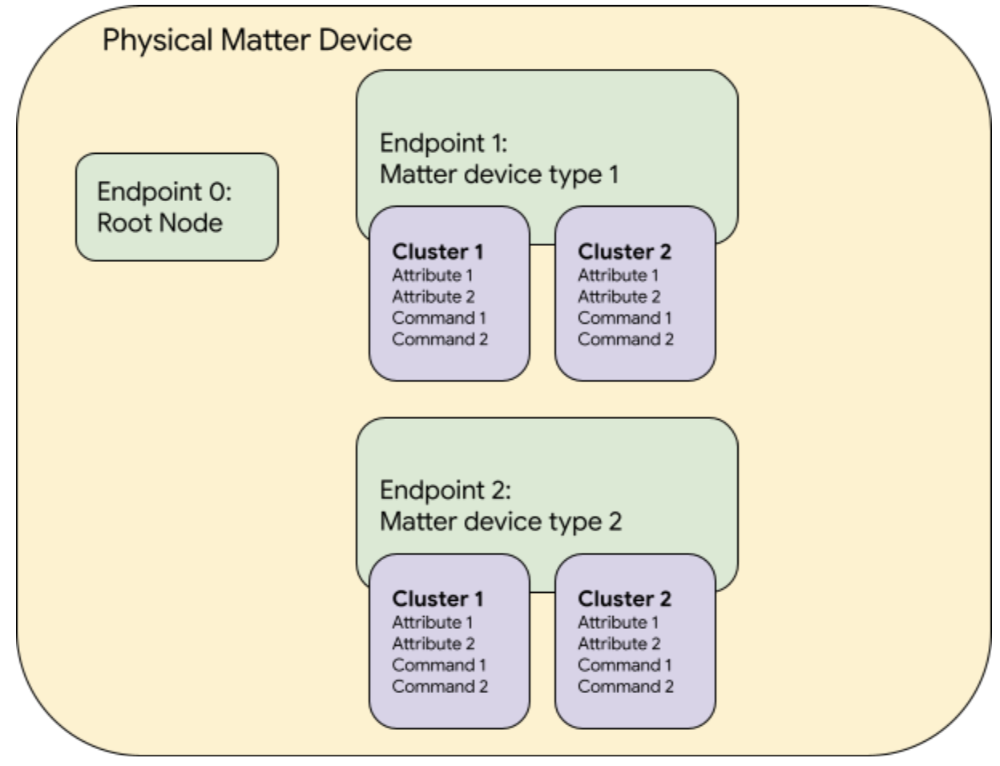
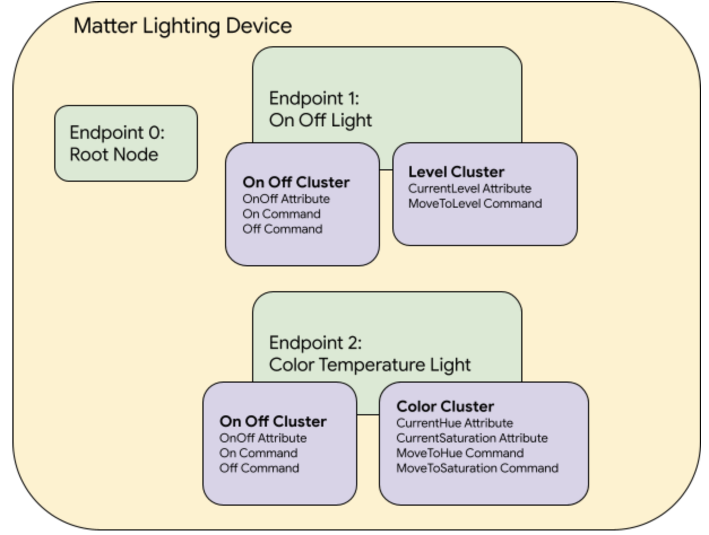

# Matter Endpoints capability in GDM

## What is Matter

Matter is an industrial smart home protocol which simplifies development for
manufacturers and increases compatibility for consumers. The protocol is built
around a shared belief that smart home devices should be secure, reliable, and
seamless to use. By building upon Internet Protocol (IP), the project aims to
enable communication across smart home devices, mobile apps, and cloud services
and to define a specific set of IP-based networking technologies for device
certification. For more information, please visit
[Matter open source repository](https://github.com/project-chip/connectedhomeip).

## Matter Endpoint

A Matter endpoint is a logical instance of a device type within the physical,
addressable Matter device. For example, for a device which has 3 dimmable lights
on it and each endpoint houses an instance of the `DimmableLight` device type,
with `OnOff` and `Level` cluster on each endpoint.

A physical device can have multiple endpoints. Each endpoint also houses
different required or optional clusters. Each cluster possesses their
corresponding attributes and commands defined in the Matter spec. Note that the
endpoint ID 0 is the root node endpoint defined by the Matter spec. This
endpoint is akin to a "read me first" endpoint that describes itself and the
other endpoints that make up the node. In addition to the root node endpoint,
other endpoints must correspond to one of the "Matter device types" defined by
the Matter spec.

Below is a basic diagram of how Matter endpoints, clusters, and cluster
attributes/commands are organized:



For a lighting device which has 1 `OnOffLight` endpoint and 1
`ColorTemperatureLight` endpoint, the structure will look like:



## Matter Endpoint Capability in GDM

Matter endpoint capability can be accessed over 2 different protocols:

1.  PigweedRPC. The capability is initialized by a
    [MatterDeviceBase](https://github.com/google/gazoo-device/tree/master/gazoo_device/base_classes/matter_device_base.py)
    and provides full device control and logging, but is only available if
    implemented by the firmware.

2.  Matter. The capability is initialized by a
    [RaspberryPiMatterController](https://github.com/google/gazoo-device/blob/master/gazoo_device/auxiliary_devices/raspberry_pi_matter_controller.py),
    which uses
    [chip-tool](https://github.com/project-chip/connectedhomeip/blob/master/docs/guides/chip_tool_guide.md)
    to interact with any commissioned Matter device over the Matter protocol.

The endpoint capability relies on the
[MatterEndpointsAccessor](https://github.com/google/gazoo-device/blob/master/gazoo_device/capabilities/interfaces/matter_endpoints_base.py)
capability to discover the supported endpoints and clusters on the device and
provide it with the appropriate flavor of the cluster capability classes for
initialization. See
[MatterEndpointsAccessorPwRpc](https://github.com/google/gazoo-device/blob/master/gazoo_device/capabilities/matter_endpoints_accessor_pw_rpc.py)
and
[MatterEndpointsAccessorChipTool](https://github.com/google/gazoo-device/blob/master/gazoo_device/capabilities/matter_endpoints_accessor_chip_tool.py)
for PigweedRPC and chip-tool implementations of the accessor capability.

All the supported Matter endpoints in GDM are listed in the
[matter_endpoints directory](https://github.com/google/gazoo-device/tree/master/gazoo_device/capabilities/matter_endpoints).
Supported devices include endpoint aliases in the format of: `dut.door_lock`,
`dut.dimmable_light`, `dut.on_off_light` and so on.

The cluster implementations can be found in the
[matter_clusters directory](https://github.com/google/gazoo-device/tree/master/gazoo_device/capabilities/matter_clusters).
Clusters are suffixed with either `_pw_rpc` or `_chip_tool` based on the
underlying protocols used.

### Accessing Matter Endpoints over PigweedRPC

A Matter endpoint capability wrapper `matter_endpoints` is defined in the
[matter_base_device](https://github.com/google/gazoo-device/tree/master/gazoo_device/base_classes/matter_device_base.py)
module, which is for interacting with Matter endpoints. Also, all the supported
Matter endpoint aliases are defined in the same base class module. These aliases
represent all capabilities a generic Matter device class (ex:
[nrf_matter](https://github.com/google/gazoo-device/tree/master/gazoo_device/primary_devices/nrf_matter.py))
could support, while an individual device may not implement all of them. This is
a fundamental design decision to support the generic Matter device classes
([NRF](https://github.com/google/gazoo-device/blob/master/docs/device_setup/NRF_Matter_sample_app.md),
[EFR32](https://github.com/google/gazoo-device/blob/master/docs/device_setup/EFR32_Matter_sample_app.md),
[ESP32](https://github.com/google/gazoo-device/blob/master/docs/device_setup/ESP32_Matter_sample_app.md))
which is contrast to other GDM capabilities where defining a capability in a
device class means that it's implemented by the device.

For example, a `NrfMatter` device instance with a `DimmableLight` endpoint does
not have a `DoorLock` endpoint, so trying to access the `door_lock` endpoint on
the device will raise a `DeviceError`:

```
>>> nrf.door_lock
nrfmatter-4585 starting MatterEndpointsAccessorPwRpc.get_endpoint_instance_by_class(endpoint_class=<class 'gazoo_device.capabilities.matter_endpoints.door_lock.DoorLockEndpoint'>)
nrfmatter-4585 starting MatterEndpointsAccessorPwRpc.get_endpoint_id(endpoint_class=<class 'gazoo_device.capabilities.matter_endpoints.door_lock.DoorLockEndpoint'>)
Traceback (most recent call last):
  ....
    raise errors.DeviceError(
gazoo_device.errors.DeviceError: Class <class 'gazoo_device.capabilities.matter_endpoints.door_lock.DoorLockEndpoint'> is not supported on nrfmatter-4585.
```

On the other hand, accessing the `dimmable_light` endpoint should work:

```
>>> nrf.dimmable_light.on_off.onoff
True
```

See the below API usages for checking the supported endpoints on the device.

### Accessing Matter Endpoints over the Matter Protocol

GDM supports an
[RaspberryPiMatterController](./device_setup/Raspberry_Pi_as_matter_controller.md)
auxiliary device type, backed by
[chip-tool](https://github.com/project-chip/connectedhomeip/blob/master/docs/guides/chip_tool_guide.md),
a Matter controller implementation that allows users to commission a Matter
device into the network and to communicate with it using Matter messages, which
may encode Data Model actions, such as cluster commands.

Similar to
[MatterDeviceBase](https://github.com/google/gazoo-device/blob/master/gazoo_device/base_classes/matter_device_base.py),
RaspberryPiMatterController implements `matter_endpoints` and all the supported
cluster aliases for interacting with a Matter device. However, the endpoints and
clusters in this case refer to the ones supported on the Matter device that has
been commissioned onto the controller's fabric. The controller itself does not
have any accessible endpoints or clusters. The `matter_endpoints` capability
initialized by the controller uses
[`matter_endpoints_accessor_chip_tool.MatterEndpointsAccessorChipTool`](https://github.com/google/gazoo-device/blob/master/gazoo_device/capabilities/matter_endpoints_accessor_chip_tool.py)
backed by `chip-tool` for discovery and control of the end device over Matter
protocol, instead of PigweedRPC.

`chip-tool` based cluster implementations can be found under
[matter_clusters directory](https://github.com/google/gazoo-device/tree/master/gazoo_device/capabilities/matter_clusters)
with `_chip_tool` suffix.

See below for an example usage with a `NrfMatter` device:

```
# Read NRF's dimmable light onoff state over PigweedRPC.
>>> nrf.dimmable_light.on_off.onoff
True

# NRF must be commissioned onto RaspberryPiMatterController's fabric to enable control over Matter protocol.
>>> rpi.matter_controller.commission(node_id=1234, setup_code=nrf.pairing_code, long_discriminator=nrf.pairing_discriminator)

# Print the Matter node ID of the device associated with the RaspberryPiMatterController.
>>> rpi.matter_node_id
1234

# Read NRF's dimmable light onoff state over Matter protocol.
>>> rpi.dimmable_light.on_off.onoff
True

# Send toggle command to the NRF from RaspberryPiMatterController.
>>> rpi.dimmable_light.on_off.toggle()

>>> nrf.dimmable_light.on_off.onoff
False
```

Again, note that while the `chip-tool` flavor of Matter endpoint and cluster
capabilities are attached to the RaspberryPiMatterController, the capabilities
modify the state of the Matter end device instead of the controller. This is due
to `chip-tool`'s restriction that only supports commissioning a single device at
a time and the needs to control a Matter end device from multiple
RaspberryPiMatterControllers.

## Matter Endpoint API usage

Both the generic Matter device classes and RaspberryPiMatterController use
Descriptor cluster to list the supported endpoints on the device. Users can use
`matter_endpoints.get` or alias to access the supported endpoint instance.

All the APIs below are supported on both flavors of the endpoint capability,
unless otherwise noted.

Below, `dut` refers to an instance of either a Matter device or
RaspberryPiMatterController class. If there is a difference in behavior or
output between the two, the RaspberryPiMatterController will be referred to as
`rpi`.

### Aliases

#### `color_temperature_light`

Alias for accessing `ColorTemperatureLight` endpoint and its supported clusters.

```
# Check the OnOff state on the OnOff cluster on the ColorTemperatureLight endpoint.
>>> dut.color_temperature_light.on_off.onoff
```

The supported clusters can be found in the
[GDM ColorTemperatureLight implementation](https://github.com/google/gazoo-device/blob/master/gazoo_device/capabilities/matter_endpoints/color_temperature_light.py).

#### `contact_sensor`

Alias for accessing `ContactSensor` endpoint and its supported clusters.

```
# Check the StateValue on the BooleanState cluster on the ContactSensor endpoint.
>>> dut.contact_sensor.boolean_state.state_value
```

The supported clusters can be found in the
[GDM ContactSensor implementation](https://github.com/google/gazoo-device/blob/master/gazoo_device/capabilities/matter_endpoints/contact_sensor.py).

#### `dimmable_light`

Alias for accessing `DimmableLight` endpoint and its supported clusters.

```
# Check the OnOff state on the OnOff cluster on the DimmableLight endpoint.
>>> dut.dimmable_light.on_off.onoff
```

The supported clusters can be found in the
[GDM DimmableLight implementation](https://github.com/google/gazoo-device/blob/master/gazoo_device/capabilities/matter_endpoints/dimmable_light.py).

#### `door_lock`

Alias for accessing `DoorLock` endpoint and its supported clusters.

```
# Check the LockState attribute on the DoorLock cluster on the DoorLock endpoint.
>>> dut.door_lock.door_lock.lock_state
```

The supported clusters can be found in the
[GDM DoorLock implementation](https://github.com/google/gazoo-device/blob/master/gazoo_device/capabilities/matter_endpoints/door_lock.py).

#### `extended_color_light`

Alias for accessing `ExtendedColorLight` endpoint and its supported clusters.

```
# Check the OnOff state on the OnOff cluster on the ExtendedColorLight endpoint.
>>> dut.extended_color_light.on_off.onoff
```

The supported clusters can be found in the
[GDM ExtendedColorLight implementation](https://github.com/google/gazoo-device/blob/master/gazoo_device/capabilities/matter_endpoints/extended_color_light.py).

#### `flow_sensor`

Alias for accessing `FlowSensorEndpoint` endpoint and its supported clusters.

```
# Check the measured_value on the FlowMeasurement cluster on the FlowSensor endpoint.
>>> dut.flow_sensor.flow_measurement.measured_value
```

The supported clusters can be found in the
[GDM FlowSensorEndpoint implementation](https://github.com/google/gazoo-device/blob/master/gazoo_device/capabilities/matter_endpoints/flow_sensor.py).

#### `humidity_sensor`

Alias for accessing `HumiditySensor` endpoint and its supported clusters.

```
# Check the MeasuredValue attribute on the RelativeHumidityMeasurement cluster on the HumiditySensor endpoint.
>>> dut.humidity_sensor.relative_humidity_measurement.measured_value
```

The supported clusters can be found in the
[GDM HumiditySensor implementation](https://github.com/google/gazoo-device/blob/master/gazoo_device/capabilities/matter_endpoints/humidity_sensor.py).

#### `light_sensor`

Alias for accessing `LightSensorEndpoint` endpoint and its supported clusters.

```
# Check the measured_value on the IlluminanceMeasurement cluster on the LightSensor endpoint.
>>> dut.light_sensor.illuminance_measurement.measured_value
```

The supported clusters can be found in the
[GDM LightSensorEndpoint implementation](https://github.com/google/gazoo-device/blob/master/gazoo_device/capabilities/matter_endpoints/light_sensor.py).

#### `occupancy_sensor`

Alias for accessing `OccupancySensor` endpoint and its supported clusters.

```
# Check the Occupancy attribute on the OccupancySensing cluster on the OccupancySensor endpoint.
>>> dut.occupancy_sensor.occupancy_sensing.occupancy
```

The supported clusters can be found in the
[GDM OccupancySensor implementation](https://github.com/google/gazoo-device/blob/master/gazoo_device/capabilities/matter_endpoints/occupancy_sensor.py)

#### `on_off_light`

Alias for accessing `OnOffLight` endpoint and its supported clusters.

```
# Check the OnOff state on the OnOff cluster on the OnOffLight endpoint.
>>> dut.on_off_light.on_off.onoff
```

The supported clusters can be found in the
[GDM OnOffLight implementation](https://github.com/google/gazoo-device/blob/master/gazoo_device/capabilities/matter_endpoints/on_off_light.py).

#### `on_off_light_switch`

Alias for accessing `OnOffLightSwitch` endpoint and its supported clusters.

```
# Check the OnOff state on the OnOff cluster on the OnOffLightSwitch endpoint.
>>> dut.on_off_light_switch.on_off.onoff
```

The supported clusters can be found in the
[GDM OnOffLightSwitch implementation](https://github.com/google/gazoo-device/blob/master/gazoo_device/capabilities/matter_endpoints/on_off_light_switch.py).


#### `on_off_plugin_unit`

Alias for accessing `OnOffPluginUnit` endpoint and its supported clusters.

```
# Check the OnOff state on the OnOff cluster on the OnOffPluginUnit endpoint.
>>> dut.on_off_plugin_unit.on_off.onoff
```

The supported clusters can be found in the
[GDM OnOffPluginUnit implementation](https://github.com/google/gazoo-device/blob/master/gazoo_device/capabilities/matter_endpoints/on_off_plugin_unit.py).

#### `pressure_sensor`

Alias for accessing `PressureSensor` endpoint and its supported clusters.

```
# Check the MeasuredValue attribute on the PressureMeasurement cluster on the PressureSensor endpoint.
>>> dut.pressure_sensor.pressure_measurement.measured_value
```

The supported clusters can be found in the
[GDM PressureSensor implementation](https://github.com/google/gazoo-device/blob/master/gazoo_device/capabilities/matter_endpoints/pressure_sensor.py).

#### `temperature_sensor`

Alias for accessing `TemperatureSensor` endpoint and its supported clusters.

```
# Check the MeasuredValue attribute on the TemperatureMeasurement cluster on the TemperatureSensor endpoint.
>>> dut.temperature_sensor.temperature_measurement.measured_value
```

The supported clusters can be found in the
[GDM TemperatureSensor implementation](https://github.com/google/gazoo-device/blob/master/gazoo_device/capabilities/matter_endpoints/temperature_sensor.py).

#### `root_node`

Alias for accessing `RootNode` endpoint and its supported clusters.

```
# Check the SoftwareVersion attribute on the BasicInformation cluster on the RootNode endpoint.
>>> dut.root_node.basic_information.software_version
```

The supported clusters can be found in the
[GDM RootNode implementation](https://github.com/google/gazoo-device/blob/master/gazoo_device/capabilities/matter_endpoints/root_node.py).

#### `speaker`

Alias for accessing `Speaker` endpoint and its supported clusters.

```
# Check the OnOff attribute on the OnOff cluster on the Speaker endpoint.
>>> dut.speaker.on_off.onoff
True
```

The supported clusters can be found in the
[GDM Speaker implementation](https://github.com/google/gazoo-device/blob/master/gazoo_device/capabilities/matter_endpoints/speaker.py).

#### `window_covering`

Alias for accessing `WindowCovering` endpoint and its supported clusters.

```
# Check the CurrentPositionLiftPercentag attribute on the WindowCovering cluster
 on the WindowCovering endpoint.
>>> dut.window_covering.window_covering.current_position_lift_percentage
```

The supported clusters can be found in the
[GDM WindowCovering implementation](https://github.com/google/gazoo-device/blob/master/gazoo_device/capabilities/matter_endpoints/window_covering.py).

### APIs of the Matter Endpoints capability

#### `list()`

List the supported endpoint ID to endpoint class mapping on the device.

```
>>> dut.matter_endpoints.list()
{1: <class 'gazoo_device.capabilities.matter_endpoints.dimmable_light.DimmableLightEndpoint'>}
```

The keys in the mapping are Matter endpoint IDs on the device.

#### `get(endpoint_id)`

Get the endpoint instance by the given endpoint ID.

```
>>> dut.matter_endpoints.get(1)
<gazoo_device.capabilities.matter_endpoints.on_off_light.OnOffLightEndpoint object at 0x7fca9d346eb0>
>>> dut.matter_endpoints.get(1).on_off.onoff
True
```

#### `reset()`

Reset the endpoint ID to endpoint class mapping on the device. This method will
be automatically called after a new build is flashed to the dev board via the
GDM `flash_build` capability. Users don't need to call this method explicitly.

```
>>> dut.matter_endpoints.reset()
```

#### `has_endpoints(endpoint_names)`

Return if the device supports all of the given endpoint names.

```
>>> dut.matter_endpoints.has_endpoints(["dimmable_light"])
True
>>> dut.matter_endpoints.has_endpoints(["door_lock"])
False
```

#### `get_supported_endpoints()`

Return a list of the supported endpoint names on the device.

```
>>> dut.matter_endpoints.get_supported_endpoints()
["dimmable_light", "on_off_light"]
```

#### `get_supported_endpoint_flavors()`

Return a list of the supported endpoint flavors on the device.

```
>>> dut.matter_endpoints.get_supported_endpoint_flavors()
[<class 'gazoo_device.capabilities.matter_endpoints.dimmable_light.DimmableLightEndpoint'>,
<class 'gazoo_device.capabilities.matter_endpoints.on_off_light.OnOffLightEndpoint'>]
```

#### `get_supported_endpoints_and_clusters()`

Return a mapping of the supported endpoint ID to the set of cluster names.

```
>>> dut.matter_endpoints.get_supported_endpoints_and_clusters()
{1: ['color_control_cluster', 'door_lock_cluster', 'level_control_cluster', 'on_off_cluster'], 2: ['on_off_cluster']}
```

#### `get_supported_endpoint_instances_and_cluster_flavors()`

Return a mapping of the supported endpoint instance to the set of cluster
flavors.

```
>>> dut.matter_endpoints.get_supported_endpoint_instances_and_cluster_flavors()
{<gazoo_device.capabilities.matter_endpoints.on_off_light.OnOffLightEndpoint object at 0x7f70b1501580>:
frozenset({<class 'gazoo_device.capabilities.matter_clusters.level_control_pw_rpc.LevelControlClusterPwRpc'>,
<class 'gazoo_device.capabilities.matter_clusters.on_off_pw_rpc.OnOffClusterPwRpc'>,
<class 'gazoo_device.capabilities.matter_clusters.color_control_pw_rpc.ColorControlClusterPwRpc'>,
<class 'gazoo_device.capabilities.matter_clusters.door_lock_pw_rpc.DoorLockClusterPwRpc'>}),
<gazoo_device.capabilities.matter_endpoints.on_off_light.OnOffLightEndpoint object at 0x7f70b1501f40>:
frozenset({<class 'gazoo_device.capabilities.matter_clusters.on_off_pw_rpc.OnOffClusterPwRpc'>})})

# RaspberryPiMatterController returns chip-tool flavor of the cluster capabilities.
>>> rpi.matter_endpoints.get_supported_endpoint_instances_and_cluster_flavors()
{<gazoo_device.capabilities.matter_endpoints.on_off_light.OnOffLightEndpoint object at 0x7f70b1501580>:
frozenset({<class 'gazoo_device.capabilities.matter_clusters.level_control_chip_tool.LevelControlClusterChipTool'>,
<class 'gazoo_device.capabilities.matter_clusters.on_off_chip_tool.OnOffClusterChipTool'>,
<class 'gazoo_device.capabilities.matter_clusters.color_control_chip_tool.ColorControlClusterChipTool'>,
<class 'gazoo_device.capabilities.matter_clusters.door_lock_chip_tool.DoorLockClusterChipTool'>}),
<gazoo_device.capabilities.matter_endpoints.on_off_light.OnOffLightEndpoint object at 0x7f70b1501f40>:
frozenset({<class 'gazoo_device.capabilities.matter_clusters.on_off_chip_tool.OnOffClusterChipTool'>})})
```

#### `read(endpoint_id, cluster_id, attribute_id, attribute_type)`

Ember API read method to read the data from a specific endpoint with given
cluster ID, attribute ID and attribute type. The Ember API can be used to
interact with any Matter endpoint, including ones that don't have GDM support
yet. It's mostly called by the cluster instance and generally doesn't need to be
called by the users.

This API is not supported by chip-tool flavor of the capability. Use
[MatterController](https://github.com/google/gazoo-device/blob/master/gazoo_device/capabilities/matter_controller_chip_tool.py)'s
read method instead.

```
>>> dut.matter_endpoints.read(endpoint_id=1. cluster_id=6, attribute_id=0, attribute_type=16)
data_bool: false
```

#### `write(endpoint_id, cluster_id, attribute_id, attribute_type, **data_kwargs)`

Ember API write method to write the data to a specific endpoint with given
cluster ID, attribute ID and attribute type. The Ember API can be used to
interact with any Matter endpoint, including ones that don't have GDM support
yet. It's mostly called by the cluster instance and generally doesn't need to be
called by the users.

This API is not supported by chip-tool flavor of the capability. Use
[MatterController](https://github.com/google/gazoo-device/blob/master/gazoo_device/capabilities/matter_controller_chip_tool.py)'s
write method instead.

```
>>> dut.matter_endpoints.write(endpoint_id=1. cluster_id=6, attribute_id=0, attribute_type=16, data_bool=True)
```

### APIs / properties of endpoint instances

The APIs and properties that exist on all endpoint instances. The below code
snippets use `on_off_light` as examples.

#### `id`

Return the endpoint ID of the instance.

```
>>> dut.on_off_light.id
1
```

#### `name`

Return the endpoint name of the instance.

```
>>> dut.on_off_light.name
'on_off_light'
```

#### `has_clusters(cluster_names)`

Return if the device supports all of the given cluster names.

```
>>> dut.on_off_light.has_clusters(['level_control', 'on_off'])
True
>>> dut.on_off_light.has_clusters(['door_lock'])
False
```

#### `get_supported_clusters()`

Return a list of the supported cluster names on the endpoint.

```
>>> dut.on_off_light.get_supported_clusters()
['level_control_cluster', 'occupancy_sensing_cluster', 'on_off_cluster']
```

#### `get_supported_cluster_flavors()`

Return a list of the supported cluster flavors on the endpoint.

```
>>> dut.on_off_light.get_supported_cluster_flavors()
frozenset({<class 'gazoo_device.capabilities.matter_clusters.occupancy_sensing_pw_rpc.OccupancySensingClusterPwRpc'>,
<class 'gazoo_device.capabilities.matter_clusters.level_control_pw_rpc.LevelControlClusterPwRpc'>,
<class 'gazoo_device.capabilities.matter_clusters.on_off_pw_rpc.OnOffClusterPwRpc'>})

# RaspberryPiMatterController returns chip-tool flavor of the cluster capabilities.
>>> rpi.on_off_light.get_supported_cluster_flavors()
frozenset({<class 'gazoo_device.capabilities.matter_clusters.occupancy_sensing_pw_rpc.OccupancySensingClusterPwRpc'>,
<class 'gazoo_device.capabilities.matter_clusters.level_control_pw_rpc.LevelControlClusterPwRpc'>,
<class 'gazoo_device.capabilities.matter_clusters.on_off_pw_rpc.OnOffClusterPwRpc'>})
```

### APIs of Pigweed RPC common service

Ideally, every Matter device supports the common device RPC services defined by
the
[device_service.proto](https://github.com/project-chip/connectedhomeip/blob/master/examples/common/pigweed/protos/device_service.proto).
Those services can also be accessed by `pw_rpc_common` capability on every
Matter device controller in GDM.

#### software_version

Return the current firmware version of the device.

```
>>> dut.pw_rpc_common.software_version
"v1.0"
```

Alternatively, it can be accessed via device class alias for convenience:

```
>>> dut.firmware_version
```

#### qr_code / qr_code_url

Return the pairing QR code / QR code URL.

```
>>> dut.pw_rpc_common.qr_code
'MT:-24J042C00KA0648G00'
>>> dut.pw_rpc_common.qr_code_url
'https://dhrishi.github.io/connectedhomeip/qrcode.html?data=MT%3A-24J042C00KA0648G00'
```

#### pairing_state

Return the pairing state of the device (True if it's paired, false otherwise).

```
>>> dut.pw_rpc_common.pairing_state
True
```

#### pairing_code / pairing_discriminator

Return the pairing code / pairing discriminator.

```
>>> dut.pw_rpc_common.pairing_code
20202021
>>> dut.pw_rpc_common.pairing_discriminator
3840
```

#### set_pairing_info(code, discriminator)

Set a specific pairing code and/or a pairing discriminator.

```
>>> dut.pw_rpc_common.set_pairing_info(code=10, discriminator=20)
```

#### reboot()

Reboot the device.

```
>>> dut.pw_rpc_common.reboot()
```

Alternatively

```
>>> dut.reboot()
```

#### factory_reset()

Factory reset the device.

```
>>> dut.pw_rpc_common.factory_reset()
```

Alternatively

```
>>> dut.factory_reset()
```

#### ota()

Trigger OTA process.

```
>>> dut.pw_rpc_common.ota()
```

#### wait_for_bootup_complete(bootup_timeout)

Wait for the device to boot up within a specific time (seconds).

```
>>> dut.pw_rpc_common.wait_for_bootup_complete(5)
```

#### get_spake_info()

Return the device Spake2 information. SPAKE2+, a Password Authenticated Key
Exchange (PAKE) protocol run between two parties. See more information at
https://tools.ietf.org/id/draft-bar-cfrg-spake2plus-00.html

```
>>> dut.pw_rpc_common.get_spake_info()
verifier: "\271ap\252\350\0034h\204rO\351\243\262\207\303\0030\302\246`7]\027\2"
salt: "SPAKE2P Key Salt"
iteration_count: 1000
```

#### set_spake_info(verifier, salt, iteration_count)

Set the device Spake2 information.

```
>>> dut.pw_rpc_common.set_spake_info(verifier=b"verifier", salt=b"salt", iteration_count=100)
```

#### is_advertising

Returns if the device is advertising for commissioning.

```
>>> dut.pw_rpc_common.is_advertising
True
```

#### start_advertising()

Starts device advertising for commissioning. No-op if the device is already
paired or it's already advertising.

```
>>> dut.pw_rpc_common.start_advertising()
```

#### stop_advertising()

Stops advertising for commissioning. No-op if the device is not advertising.

```
>>> dut.pw_rpc_common.stop_advertising()
```

#### set_ota_metadata()

Set OTA metadata for OTA provider. Note that this API only works on device which
enables OTA requestor (with compile option
`CHIP_DEVICE_CONFIG_ENABLE_OTA_REQUESTOR`).

```
>>> dut.pw_rpc_common.set_ota_metadata(tlv_metadata=b"tlv_metadata")
```
