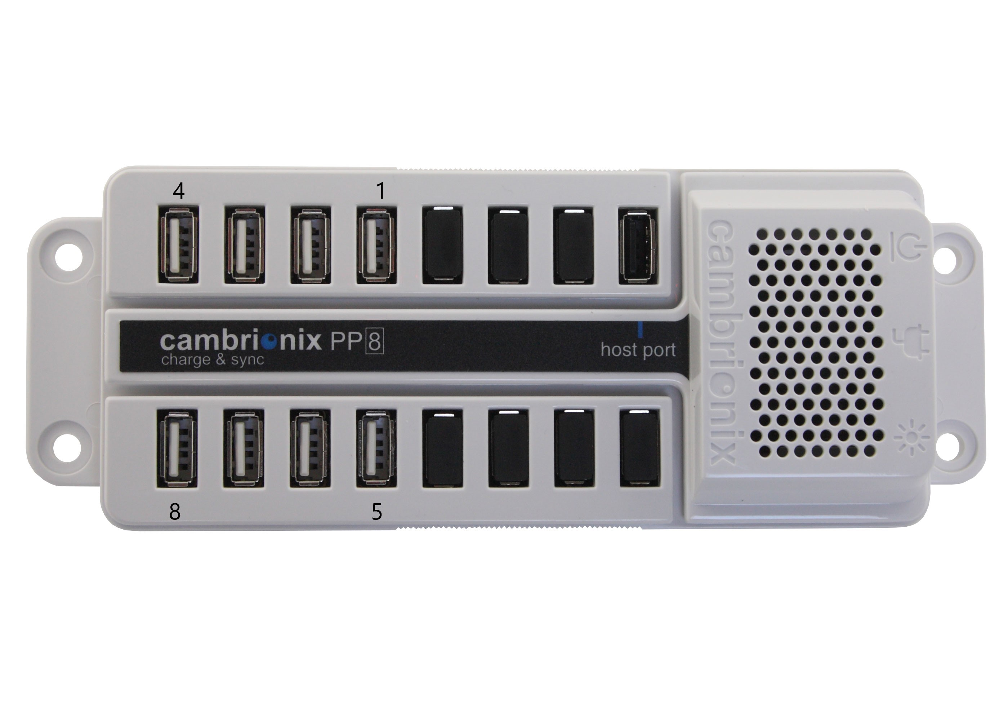
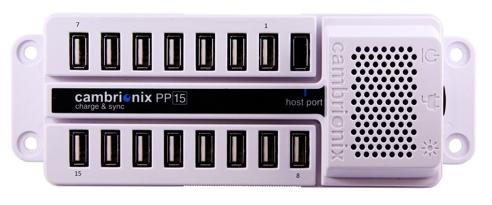

# GDM device setup: Cambrionix USB hub

Manufacturer: https://www.cambrionix.com/.

Supported models: PP15, PP8, U16S.

Port numbers:



## Setup

There are no special setup steps. \
To detect the Cambrionix, run `gdm detect`.

## Usage

```shell
gdm issue cambrionix-1234 - switch_power - power_off 2
gdm issue cambrionix-1234 - switch_power - get_mode 2
gdm issue cambrionix-1234 - switch_power - power_on 2
gdm issue cambrionix-1234 - switch_power - get_mode 2
# To see all supported functionality:
gdm man cambrionix
gdm man cambrionix switch_power
```
